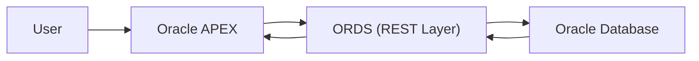

# Oracle SQL Learning Environment
Built a local Oracle Database setup and connected it with Oracle APEX via SQL Developer, using it to learn SQL and explore relational data.

## Resumé
This project demonstrates the setup of a local Oracle Database environment connected to Oracle APEX via SQL Developer.  
The goal is to learn SQL through hands-on querying and visualizing data.

## Goals
- Learn SQL through practical examples
- Write and execute database queries
- Understand relational database structures
- Visualize query results using Oracle APEX

## Tools
- ORACLE DB
- ORACLE APEX
- SQL DEVELOPER
- ORDS (Oracle REST Data Service)

## Setup & Installation
### 1. Installed Oracle Database
- Local Oracle Database installed and configured

### 2. Installed SQL Developer
- Used SQL Developer to connect to the database

### 3. Connected Oracle APEX
- Configured Oracle APEX to work with the database
- Established connection using SQL Developer

### 4. Connection Setup
- Created a database user
- Configured connection parameters in SQL Developer

### 5. Configured ORDS (Oracle REST Data Services)
- Installed and configured ORDS
- Connected Oracle Database to APEX via ORDS
- Enabled RESTful access to database resources

ORDS was used as a middleware to connect the Oracle Database with Oracle APEX.

### What ORDS does:
- Provides a REST API layer for the database
- Enables communication between APEX and the database
- Allows web-based access to database objects

### Why it is important:
- It acts as a bridge between the database and frontend (APEX)
- Makes the database accessible via web technologies

## Architecture Overview

## Database & ORDS Setup
1. Activate the Listener
2. Open Powershell as Administrator --> sqlplus / as sysdba
3. Change to existing/uniform service name --> ALTER SESSION SET CONTAINER = FREEPDB1
4. Connect APEX with Oracle DB by ORDS (keep config environment and production environment seperated) --> C:Users..(config environment)> java -jar C:Users...(prdouction environment) ords serve   
5. Connect in SQL Developer for excecuting SQL queries
6. Call up the link for connecting in APEX (frontend) --> localhost:port/ords 
